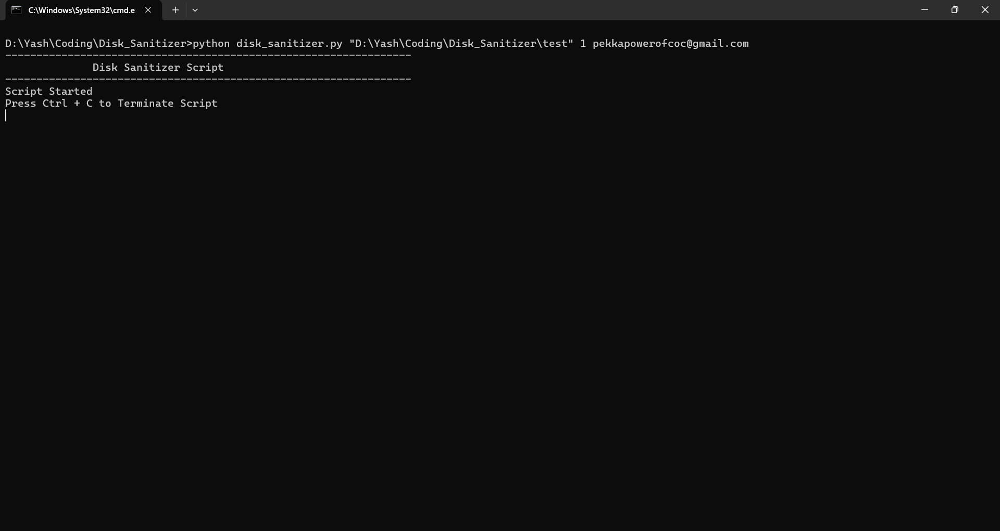
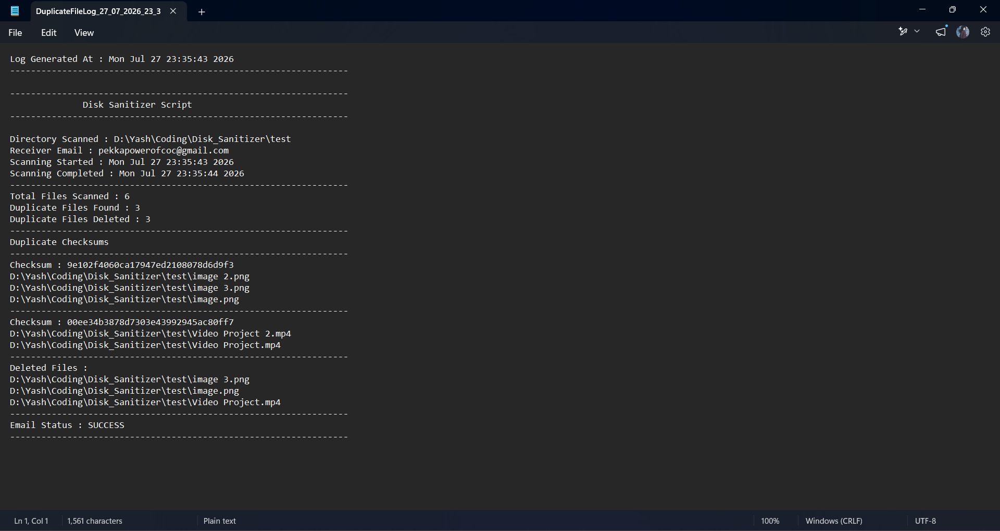
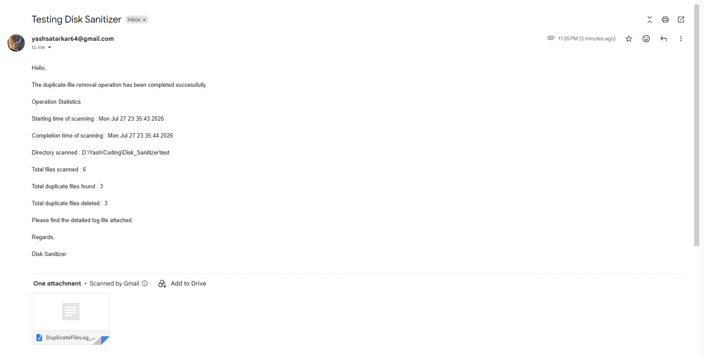

# 🧹 Disk Sanitizer


A Python-based automation utility that recursively scans directories to detect and remove **duplicate files** using **MD5 checksums**. The application generates detailed log files and automatically emails the execution report to the specified recipient. A scheduled version is also included to periodically monitor directories without user intervention.

---

# ✨ Features

* 🗂️ Recursively scans directories and subdirectories
* 📄 Detects duplicate files using **MD5 checksums**
* ⚡ Uses **file-size grouping optimization** to minimize checksum calculations
* 🗑️ Deletes duplicate files automatically while preserving one original copy
* 📝 Generates detailed log files containing scan statistics
* 📧 Sends the generated log file through email
* ⏱️ Includes a scheduled version for automatic periodic execution
* 🛡️ Handles common file operation and email exceptions gracefully
* 🧩 Modular architecture for better maintainability

---

# 📂 Project Structure

```text
Disk-Sanitizer/
│
├── duplicate_file_removal.py      # Main controller
├── validator.py                   # Input validation
├── file_utils.py                  # File scanning & duplicate detection
├── logger.py                      # Log file creation and writing
├── mail_sender.py                 # Email sender module
├── requirements.txt
├── README.md
├── LICENSE
└── screenshots/
```

---

# 🏗️ Project Architecture

The project follows a modular design where each module performs a specific responsibility.

| Module                      | Responsibility                                                            |
| --------------------------- | ------------------------------------------------------------------------- |
| `duplicate_file_removal.py` | Controls the complete execution flow                                      |
| `validator.py`              | Validates directory path, email address and time interval                 |
| `file_utils.py`             | Performs recursive scanning, checksum calculation and duplicate detection |
| `logger.py`                 | Creates log files and writes execution details                            |
| `mail_sender.py`            | Sends the generated log file as an email attachment                       |

---

# 🧠 Algorithm

## Duplicate File Detection

To improve performance, the application **does not calculate checksums for every file**.

Instead, it follows the steps below:

1. Recursively scan the specified directory.
2. Group files according to their file size.
3. Ignore groups containing only one file.
4. Compute MD5 checksums only for files having identical sizes.
5. Compare the generated checksums.
6. Delete duplicate copies while preserving one original.
7. Generate a detailed log file.
8. Email the log file to the specified recipient.

This optimization significantly reduces unnecessary checksum calculations, especially for directories containing a large number of files.

---

# 🔄 Workflow

1. Validate user inputs.
2. Scan the directory recursively.
3. Calculate MD5 checksums.
4. Detect duplicate files.
5. Delete duplicate copies.
6. Generate a detailed log file.
7. Email the log file.
8. Wait for the next scheduled execution (scheduled version only).

---

# ⚙️ Requirements

* Python 3.8 or later

Install the required dependency:

```bash
pip install -r requirements.txt
```

or install manually:

```bash
pip install schedule
```

---

# 🚀 Usage

## Scheduled Version

```bash
python duplicate_file_removal.py <AbsoluteDirectoryPath> <TimeIntervalInMinutes> <ReceiverEmailAddress>
```

### Example

```bash
python duplicate_file_removal.py "C:\Users\Yash\Downloads" 30 example@gmail.com
```

The script scans the specified directory every **30 minutes**, removes duplicate files, generates a log file and emails the report.

---

# 📋 Sample Output

```text
-----------------------------------------------------------------

Disk Sanitizer Script

-----------------------------------------------------------------

Script Started

Press Ctrl + C to Terminate Script

```

---

# 📑 Log File

The generated log contains:

* Scan start time
* Scan completion time
* Directory scanned
* Total files scanned
* Duplicate files found
* Duplicate files deleted
* Duplicate file checksums
* Deleted file list
* Email delivery status

Example:

```text
DuplicateFileLog_24_07_2026_19_25_30.log
```

---

# 📸 Screenshots

### Command Prompt



### Duplicate File Log



### Email Automation



---

# 🛠️ Technologies Used

* Python 3
* os
* hashlib
* smtplib
* email
* schedule
* datetime
* sys
* time

---

# 💡 Future Improvements

* GUI version using Tkinter or PyQt
* SHA-256 checksum option
* Multi-threaded checksum calculation
* Configuration file support
* CSV / JSON log export
* Real-time directory monitoring
* Recycle Bin support instead of permanent deletion
* Ignore selected directories and file types

---

# 👨‍💻 Author

**Yash Sachin Satarkar**

Computer Engineering Student

---

# 📄 License

This project is licensed under the **MIT License**.
